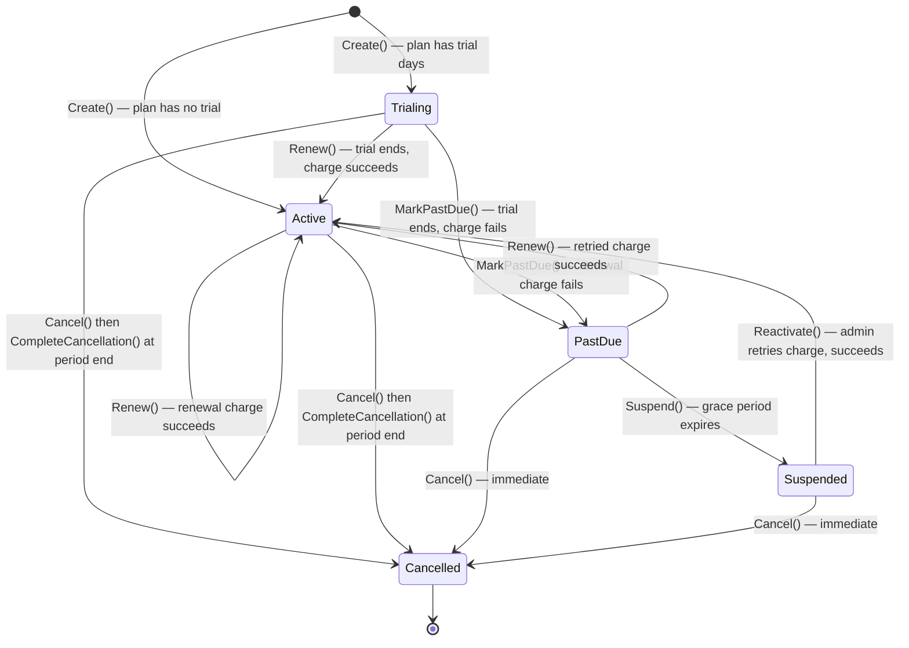

# Diagrams

Reference diagrams for the Subscription Billing platform. Both render natively on
GitHub and are also embedded directly in the root [README](../README.md).

## System architecture / request flow

How a request travels from the admin panel to the database, and how the
background billing job fits in.

Built with [archify](diagrams/architecture.html) (source:
[`diagrams/architecture.architecture.json`](diagrams/architecture.architecture.json)).
Open `diagrams/architecture.html` in a browser for the interactive version
(theme toggle, PNG/SVG export).

- **Controllers** only translate HTTP ↔ DTOs and delegate to a `Service`; no
  business rules live there.
- **Services** (one per feature, registered via DI extension methods such as
  `AddPlansFeature()`) hold the application/business logic and talk to
  `AppDbContext`.
- **SubscriptionBillingBackgroundService** runs on its own timer inside the same
  API container, independent of any incoming HTTP request, applying renewals,
  trial expirations, suspensions and pending plan changes.
- Both the API and Postgres run as separate Docker containers, orchestrated by
  the root `docker-compose.yml`.

## Subscription lifecycle

The state machine owned by the `Subscription` domain entity
(`Domain/Subscriptions/Subscription.cs`).

Notes:

- `Cancel()` on a `Trialing`/`Active` subscription only sets `CancelledAt` — the
  subscription keeps working normally until `CurrentPeriodEnd`, when the
  billing background job calls `CompleteCancellation()`. Cancelling a
  `PastDue`/`Suspended` subscription takes effect immediately instead.
- `SchedulePlanChange()` (upgrade/downgrade) doesn't move the state machine —
  it just sets a pending plan, applied by the background job at the next
  renewal (`ApplyPendingPlanChange()`).
- `SubscriptionStatus.Expired` is declared but not yet reachable in the current
  implementation — reserved for a future rule (e.g. archived plan with no
  renewal target).
